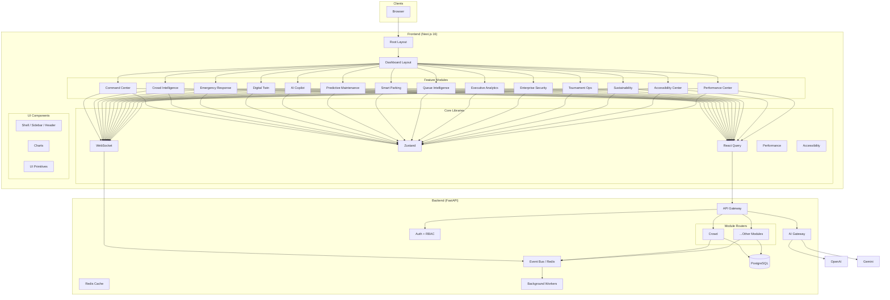
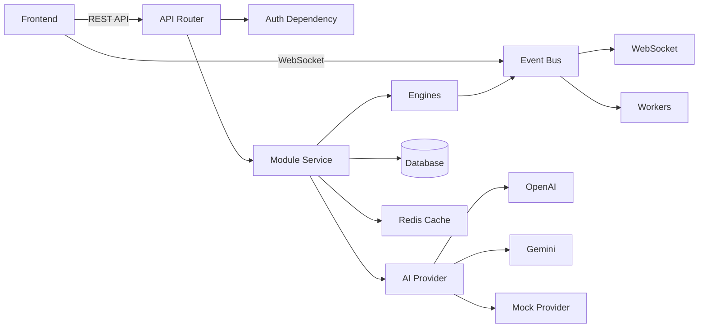
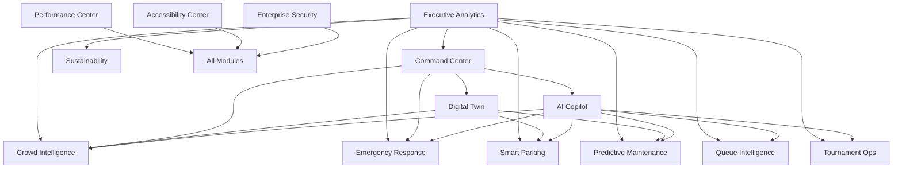
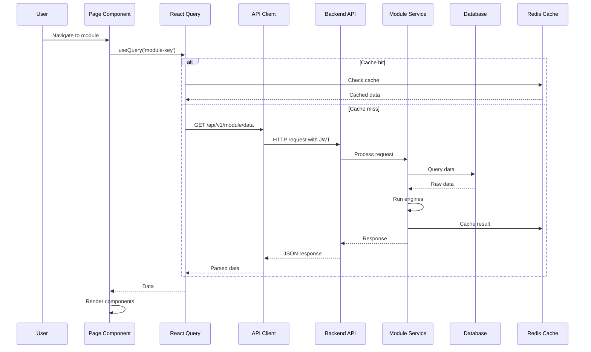
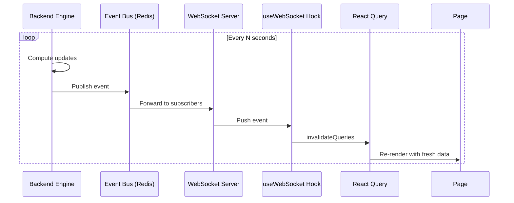
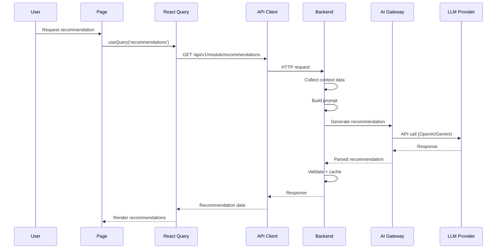
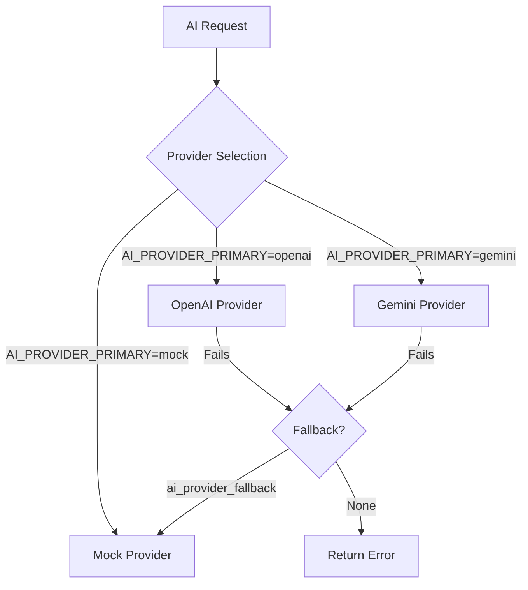
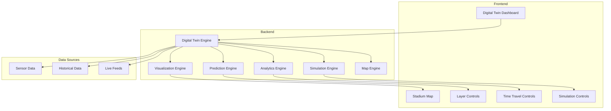
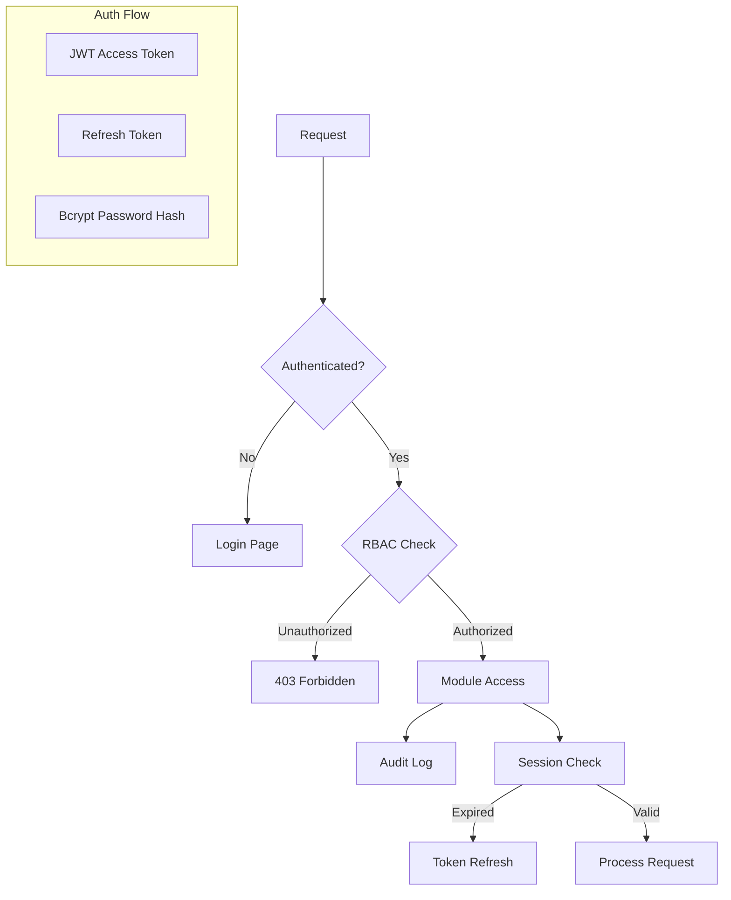
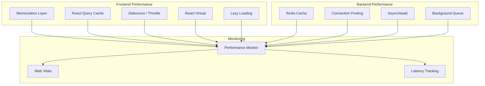

# StadiumOS AI — Architecture

> Version 1.0 · Last updated: July 2026

## Table of Contents

1. [System Overview](#system-overview)
2. [High-Level Architecture](#high-level-architecture)
3. [Frontend Architecture](#frontend-architecture)
4. [Backend Architecture](#backend-architecture)
5. [Module Architecture](#module-architecture)
6. [Data Flow](#data-flow)
7. [AI Service Layer](#ai-service-layer)
8. [Digital Twin Architecture](#digital-twin-architecture)
9. [Security Architecture](#security-architecture)
10. [Performance Architecture](#performance-architecture)
11. [Scalability Strategy](#scalability-strategy)

---

## System Overview

StadiumOS AI is a full-stack, event-driven platform that provides real-time operational intelligence for stadium management. It comprises a Next.js 16 frontend (App Router, React 19) and a FastAPI Python 3.12 backend, communicating via REST APIs and Redis-backed WebSockets.

### Design Principles

- **Feature-Sliced Architecture** — Each operational domain is a self-contained module with its own types, services, components, and tests
- **Interface-Driven Abstraction** — AI providers, engines, and services implement interfaces for hot-swappable implementations
- **Event-Driven Communication** — Backend modules communicate via a Redis event bus; frontend subscribes via WebSocket
- **Performance by Default** — Memoization, caching (TTL, stale-while-revalidate), debouncing, and concurrency control are built into the core library
- **Accessibility First** — Every component is built with WCAG 2.2 AA compliance from the ground up

---

## High-Level Architecture



---

## Frontend Architecture

### Layer Structure

```
Presentation Layer
├── App Router Pages          (app/ directory)
├── Feature Components       (features/*/components/)
└── Shared Components        (components/)

State Layer
├── Server State             (TanStack React Query)
├── Client State             (Zustand)
└── URL State                (next/navigation)

Infrastructure Layer
├── API Client               (lib/api-client.ts)
├── WebSocket                (hooks/use-websocket.ts)
├── Performance              (lib/performance/)
└── Accessibility            (lib/a11y/)
```

### Routing Structure

```mermaid
graph TD
    RL[root layout.tsx] --> PL[(auth)/layout.tsx]
    RL --> DL[(dashboard)/layout.tsx]
    
    PL --> LG[login/page.tsx]
    PL --> RG[register/page.tsx]
    
    DL --> SH[Shell component]
    SH --> SB[Sidebar]
    SH --> HD[Header]
    SH --> MC[main#main-content]
    
    MC --> CC[/command-center]
    MC --> CI[/crowd-intelligence]
    MC --> ER[/emergency-response]
    MC --> DT[/digital-twin]
    MC --> AC[/ai-copilot]
    MC --> PM[/maintenance]
    MC --> SP[/smart-parking]
    MC --> QI[/queue-intelligence]
    MC --> EA[/executive-analytics]
    MC --> ES[/enterprise-security]
    MC --> TO[/tournament-ops]
    MC --> SU[/sustainability]
    MC --> AL[/a11y-center]
    MC --> PC[/performance]
```

### State Management Strategy

| State Type | Technology | When to Use |
|-----------|-----------|-------------|
| Server state | TanStack React Query | API data, cache, background refetching |
| Client state | Zustand | UI state (theme, sidebar, active module) |
| URL state | next/navigation | Page-level state, search params |
| Form state | React Hook Form | Form inputs, validation |
| WebSocket | Custom hook + React Query | Real-time updates |

### Component Architecture

Each feature module follows the pattern:

```
features/<module>/
├── types.ts              # Domain types and interfaces
├── constants.ts          # Module-specific constants
├── services/
│   ├── <module>-service.ts    # Service orchestrator
│   ├── <domain>-engine.ts     # Domain logic engines
│   └── ...                    # Additional engines
├── components/
│   ├── main-dashboard.tsx     # Primary page component
│   ├── <domain>-panel.tsx     # Feature panels
│   └── ...                    # Supporting components
└── __tests__/
    └── <module>.test.ts       # Unit tests
```

---

## Backend Architecture

### Layer Structure

```
API Layer
├── Router                  (module-level route definitions)
├── Models                  (Pydantic request/response models)
└── Dependencies            (auth, pagination, DB session)

Service Layer
├── Module Services         (business logic orchestration)
├── AI Provider Abstraction (base.py → OpenAI/Gemini providers)
└── Event Bus               (Redis pub/sub)

Data Layer
├── SQLAlchemy Models       (database ORM models)
├── Alembic Migrations      (schema versioning)
└── Redis Cache             (aiocache-decorated functions)
```

### Module Dependency Flow



---

## Module Architecture

### Shared Module Template

Every feature module implements the same structural contract:

```typescript
// types.ts — Domain-specific type definitions
interface ModuleData {
  id: string;
  metrics: Metric[];
  status: Status;
}

// service.ts — Orchestrator that composes engines
class ModuleService {
  constructor(
    private analyticsEngine: IAnalyticsEngine,
    private predictionEngine: IPredictionEngine,
    private recommendationEngine: IRecommendationEngine,
  ) {}

  async getFullState(): Promise<ModuleState> {
    const analytics = this.analyticsEngine.compute(/* ... */);
    const predictions = this.predictionEngine.predict(/* ... */);
    const recommendations = this.recommendationEngine.generate(/* ... */);
    return { analytics, predictions, recommendations };
  }
}

// components/main-dashboard.tsx — Page-level composition
function MainDashboard() {
  const { data, isLoading } = useQuery({
    queryKey: ['module-state'],
    queryFn: () => moduleService.getFullState(),
  });
  return <DashboardShell>{/* compose sub-components */}</DashboardShell>;
}
```

### Module Dependency Graph



---

## Data Flow

### Request Lifecycle



### Real-Time Data Flow



### AI Recommendation Flow



---

## AI Service Layer

### Provider Abstraction

```python
# backend/app/ai/base.py
class AIProvider(ABC):
    @abstractmethod
    async def generate(
        self, prompt: str, context: dict
    ) -> AIResponse: ...

class OpenAIProvider(AIProvider):
    async def generate(self, prompt, context):
        # Calls OpenAI API
        ...

class GeminiProvider(AIProvider):
    async def generate(self, prompt, context):
        # Calls Google Gemini API
        ...

class MockProvider(AIProvider):
    async def generate(self, prompt, context):
        # Returns deterministic mock data for development
        ...
```

### Provider Selection Strategy



---

## Digital Twin Architecture



---

## Security Architecture



### Authentication Flow

1. User submits credentials → POST `/api/auth/login`
2. Backend validates password with bcrypt
3. Returns JWT access token (short-lived) + refresh token (long-lived)
4. Frontend stores tokens, attaches JWT to subsequent requests via `ApiClient`
5. On 401, frontend attempts silent refresh with refresh token
6. On refresh failure, redirects to login

### Role-Based Access Control

| Role | Permissions |
|------|-------------|
| `admin` | Full system access, user management, configuration |
| `operator` | Module operations, incident management |
| `viewer` | Read-only dashboard access |
| `security` | Security module + incident management |
| `maintenance` | Maintenance module + work orders |

---

## Performance Architecture



Key performance patterns:
- **Memoization** — `memoize()`, `memoizeAsync()` with TTL and LRU eviction
- **Caching** — Multi-tier (React Query → Redis → Database)
- **Concurrency** — `createAsyncQueue(n)` for controlled parallelism
- **Batching** — `createBatchProcessor()` for coalescing requests
- **Debouncing** — User input handlers, search, resize events
- **Virtualization** — TanStack React Virtual for long lists
- **Lazy Loading** — `lazyComponent()` for code-split modules

---

## Scalability Strategy

### Horizontal Scaling

| Component | Strategy |
|-----------|----------|
| Frontend | Stateless, CDN-cached static assets, Vercel edge functions |
| Backend | Multiple uvicorn workers → multiple container instances → auto-scaling |
| Database | Read replicas, connection pooling (pgbouncer-ready) |
| Cache | Redis Cluster for distributed caching |
| WebSocket | Redis pub/sub for cross-instance message broadcasting |
| Background Jobs | ARQ worker pool with Redis broker |

### Cache Strategy

```
Browser Cache (CDN)
    ↓ (Cache-Control headers)
React Query Cache (in-memory, staleTime: 30s)
    ↓ (stale-while-revalidate)
Redis Cache (aiocache, TTL: 5min)
    ↓ (cache-aside pattern)
PostgreSQL Database
```

### Data Partitioning

- Modules are logically separated by module ID prefix
- Time-series data sharded by timestamp ranges
- Read replicas handle analytics/reporting queries
- Write master handles operational transactions

---

## Technology Decisions

| Decision | Choice | Rationale |
|----------|--------|-----------|
| Framework | Next.js 16 | SSR/SSG/ISR, App Router, React Server Components, Vercel deployment |
| State | React Query + Zustand | Separation of server/client state, cache invalidation, devtools |
| Styling | Tailwind CSS | Utility-first, small bundle, consistent design tokens |
| Backend | FastAPI | Async-native, Pydantic validation, OpenAPI docs, high performance |
| Database | PostgreSQL + SQLAlchemy | Relational integrity, async ORM, mature ecosystem |
| Cache | Redis | Pub/sub, TTL, distributed, proven at scale |
| AI | Multi-provider abstraction | Avoid vendor lock-in, mock for development, failover |
| Auth | JWT + bcrypt | Stateless, industry standard, refresh rotation |
| Testing | Vitest + Playwright | Fast Vitest, comprehensive Playwright, TypeScript-native |
