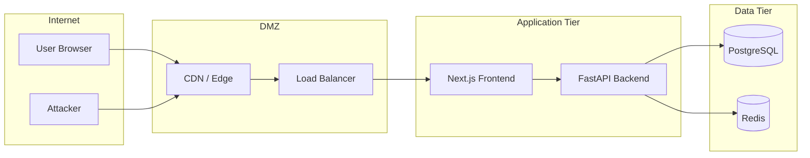

# Security Policy

## Supported Versions

| Version | Supported |
|---------|-----------|
| 0.1.x   | ✅ Active development — security fixes applied continuously |

---

## Responsible Disclosure

If you discover a security vulnerability in StadiumOS AI, please report it responsibly. **Do not** open a public GitHub issue.

### Reporting Process

1. **Email** security details to `security@stadiumos.ai`
2. Include:
   - Type of vulnerability
   - Steps to reproduce
   - Affected version(s)
   - Potential impact
   - Suggested fix (if any)
3. You will receive an acknowledgment within **48 hours**
4. We will investigate and provide updates within **5 business days**
5. Once fixed, we will notify you and publicly credit the discovery (if desired)

### Scope

- All code in the `frontend/` and `backend/` directories
- Authentication and authorization mechanisms
- API endpoints
- Database access patterns
- AI provider integration

### Out of Scope

- Third-party dependencies (report to the respective maintainer)
- Infrastructure configuration (unless misconfiguration creates a vulnerability)
- Social engineering attacks

---

## Threat Model

### Assets

| Asset | Sensitivity | Description |
|-------|-------------|-------------|
| User credentials | Critical | Username/password, JWT tokens |
| Session tokens | Critical | Active user sessions |
| API keys | Critical | OpenAI, Gemini, weather/traffic API keys |
| Operational data | High | Crowd counts, incident reports, security footage |
| Configuration | High | Database URLs, feature flags |
| Audit logs | Medium | User activity logs |

### Trust Boundaries



### Threat Scenarios

| Threat | Mitigation |
|--------|------------|
| Unauthorized API access | JWT authentication on all endpoints |
| SQL injection | SQLAlchemy ORM with parameterized queries |
| XSS | React's built-in XSS protection + Content-Security-Policy |
| CSRF | NextAuth.js CSRF tokens + SameSite cookies |
| Brute force login | Rate limiting on auth endpoints |
| Token theft | Short-lived JWT (15min) + refresh token rotation |
| Dependency vulnerability | Dependabot alerts + weekly `npm audit` / `safety check` |
| Secrets exposure | `.env*` in `.gitignore`, secrets in CI via GitHub Secrets |
| Session hijacking | Secure + HttpOnly cookies, HTTPS only |

---

## Authentication & Authorization

### JWT Token Structure

```json
{
  "sub": "user-id",
  "role": "admin",
  "iat": 1680000000,
  "exp": 1680000900,
  "type": "access"
}
```

### Token Lifecycle

1. **Access Token**: 15-minute expiry, used for API authentication
2. **Refresh Token**: 7-day expiry, used to obtain new access tokens
3. **Rotation**: Each refresh invalidates the previous refresh token
4. **Revocation**: Tokens can be revoked server-side via Redis blocklist

### RBAC Enforcement

Authorization is enforced at three layers:
1. **Frontend**: Route protection via middleware/layouts
2. **Backend**: Dependency injection in FastAPI route handlers
3. **Database**: Row-level security policies (future)

---

## Dependency Security

### Frontend

- Lock file (`pnpm-lock.yaml`) is committed to prevent supply chain attacks
- `npm audit` runs in CI with `--audit-level=high`
- Dependabot configured for automated security PRs
- All dependencies are pinned to exact versions

### Backend

- `requirements.txt` pins exact versions with hashes (future)
- `safety check` runs in CI to detect known vulnerabilities
- `bandit` static analysis runs in CI
- Python dependencies audited weekly

---

## Secrets Management

### What NOT to commit

- API keys (OpenAI, Gemini, weather, traffic)
- Database passwords
- JWT secrets (`AUTH_SECRET`)
- Any value marked as `secret` in `.env.example`

### Safe Practices

- Use `.env.local` for local development (gitignored)
- Use GitHub Secrets for CI/CD
- Use Docker secrets for production deployments
- Rotate secrets immediately if exposed
- Never hardcode secrets in source code
- Use environment variables for all configuration

---

## Security Checklist

### Pre-Release

- [ ] All API endpoints require authentication
- [ ] RBAC permissions verified for each endpoint
- [ ] SQL injection tested (parameterized queries confirmed)
- [ ] XSS vectors reviewed (all user output is escaped)
- [ ] CORS configured to allowlist only trusted origins
- [ ] Rate limiting enabled on auth and API endpoints
- [ ] Security headers configured (CSP, HSTS, X-Frame-Options)
- [ ] Dependencies scanned for vulnerabilities
- [ ] Secrets rotated from any previous exposure
- [ ] Audit logging verified for sensitive operations
- [ ] Session timeout and token rotation verified
- [ ] File upload validation (when implemented)

### Incident Response

See [Runbooks — Security Incident Response](docs/runbooks/security-incident.md).
