# Architecture Diagrams

Visual reference for StadiumOS AI system architecture.

---

## System Architecture

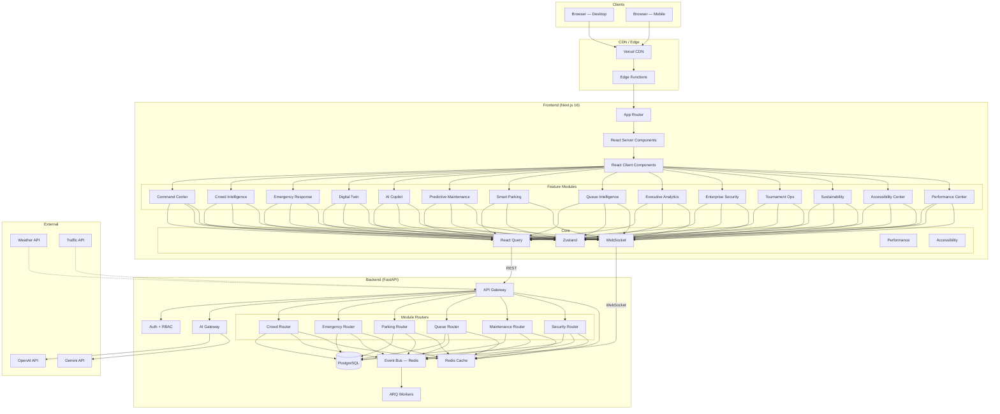

---

## Frontend Architecture

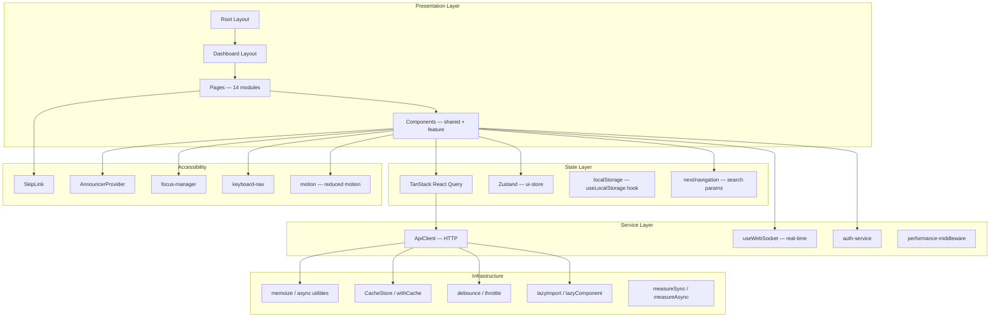

---

## Backend Architecture

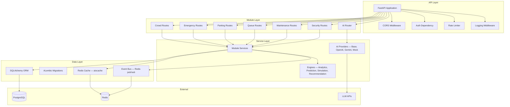

---

## Module Dependency Graph

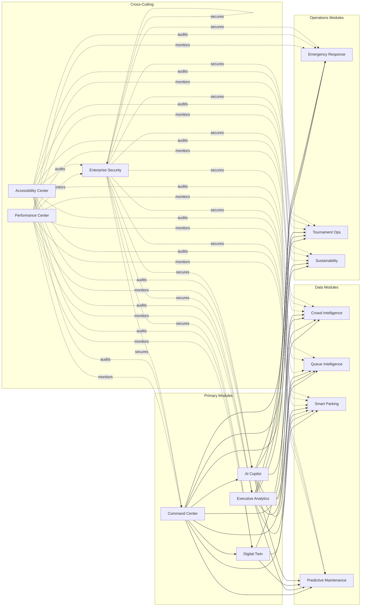

---

## Request Flow

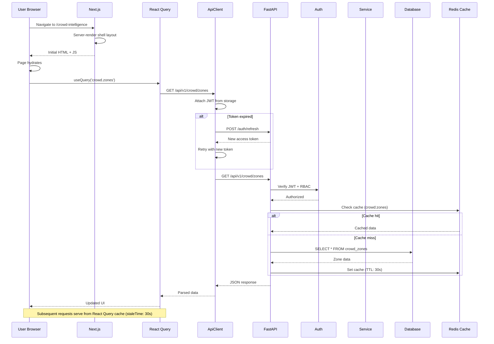

---

## Authentication Flow

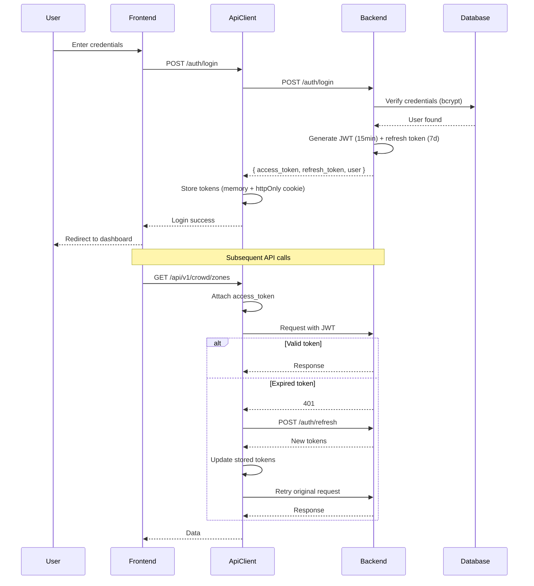

---

## AI Recommendation Flow

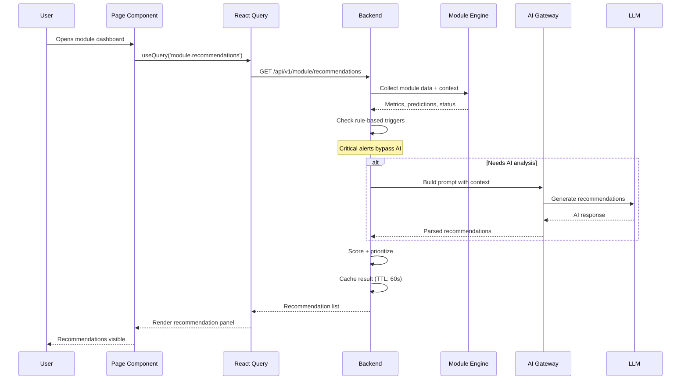

---

## Emergency Workflow

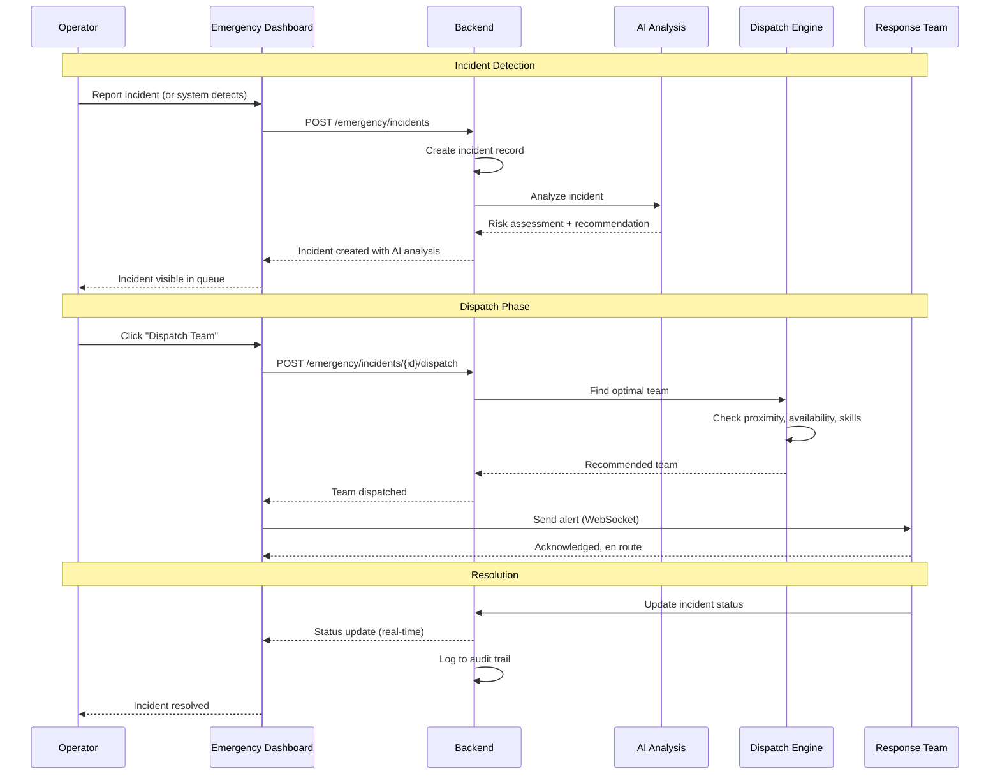

---

## Digital Twin Data Flow

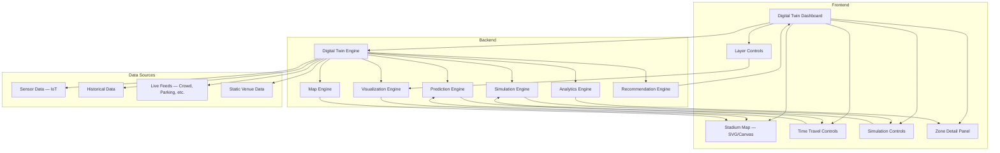

---

## Deployment Architecture

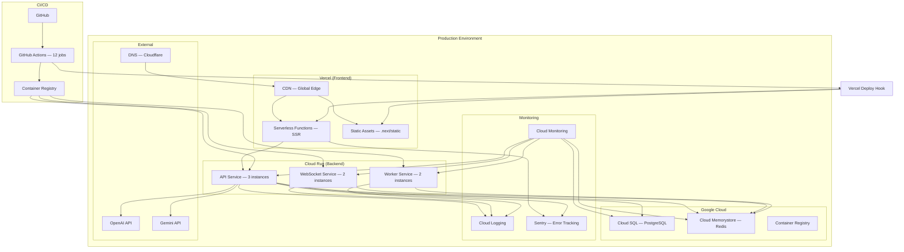

---

## Performance Architecture

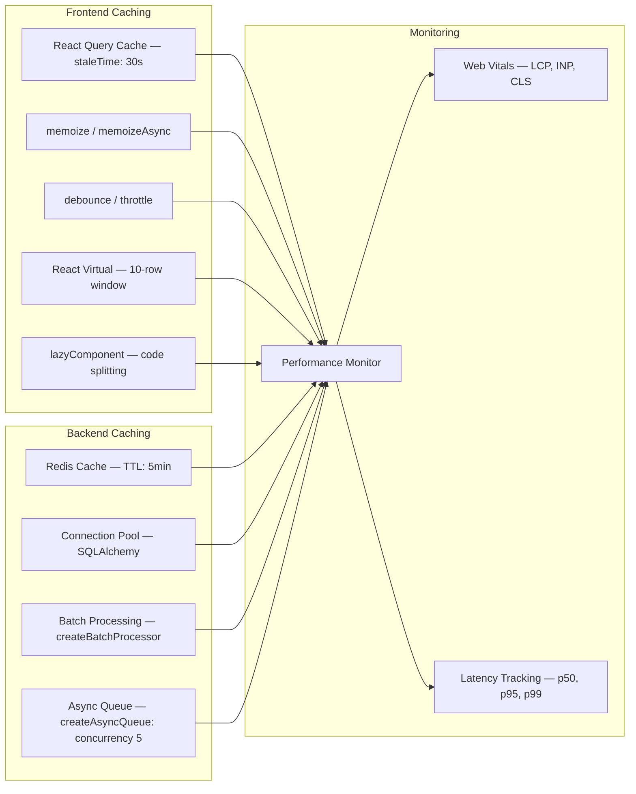

## Accessibility Architecture

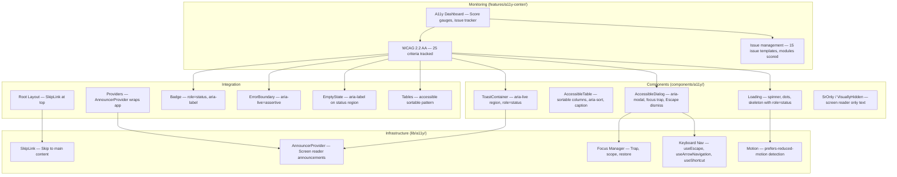
