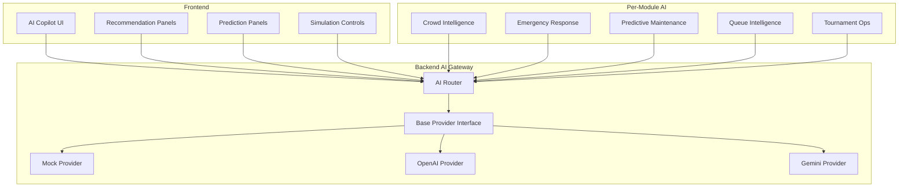
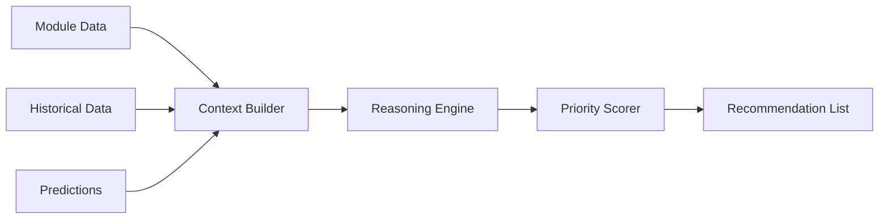
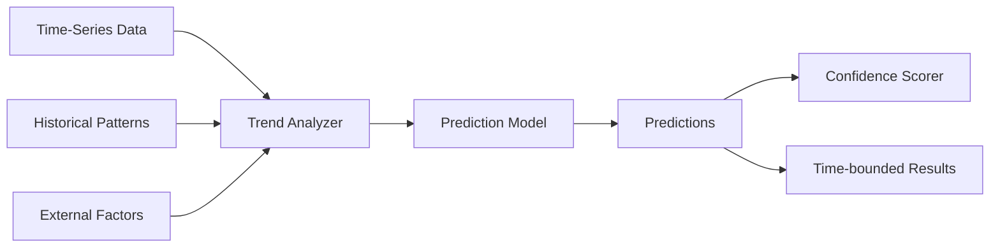
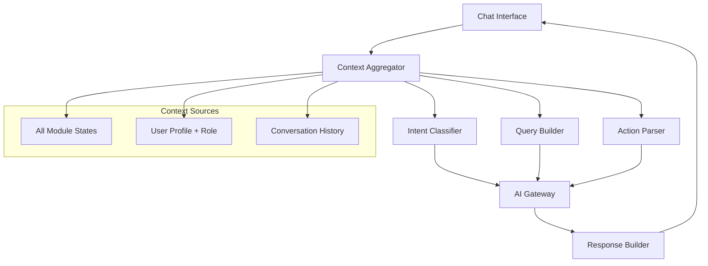

# AI Documentation

Artificial intelligence architecture, providers, and integration guide for StadiumOS AI.

---

## Table of Contents

1. [AI Architecture Overview](#ai-architecture-overview)
2. [Recommendation Engine](#recommendation-engine)
3. [Prediction Engine](#prediction-engine)
4. [Simulation Engine](#simulation-engine)
5. [AI Copilot](#ai-copilot)
6. [Prompt Architecture](#prompt-architecture)
7. [Mock AI Providers](#mock-ai-providers)
8. [Future LLM Integration](#future-llm-integration)

---

## AI Architecture Overview



### Provider Selection

AI provider is selected via environment variable:

```python
# backend/app/ai/router.py
AI_PROVIDERS = {
    "mock": MockProvider,
    "openai": OpenAIProvider,
    "gemini": GeminiProvider,
}

provider_class = AI_PROVIDERS[settings.AI_PROVIDER_PRIMARY]
provider = provider_class(settings)
```

### Provider Interface

```python
# backend/app/ai/base.py
class AIProvider(ABC):
    @abstractmethod
    async def generate(
        self,
        prompt: str,
        context: dict | None = None,
        system_prompt: str | None = None,
    ) -> AIResponse:
        """Generate an AI response from the provider."""
        pass

    @abstractmethod
    async def generate_stream(
        self,
        prompt: str,
        context: dict | None = None,
    ) -> AsyncIterator[str]:
        """Stream tokens from the provider."""
        pass
```

---

## Recommendation Engine

### Purpose

Every operational module includes a recommendation engine that generates actionable suggestions based on current state, historical data, and predicted outcomes.

### Architecture



### Implementation Pattern

```typescript
// Each module has its own recommendation engine
interface IRecommendationEngine {
  generate(context: ModuleContext): Recommendation[];
  prioritize(recommendations: Recommendation[]): Recommendation[];
}

class CrowdRecommendationEngine implements IRecommendationEngine {
  generate(context: CrowdContext): Recommendation[] {
    const recommendations: Recommendation[] = [];
    
    // Rule-based recommendations
    if (context.congestedZones.length > 3) {
      recommendations.push({
        type: "alert",
        priority: "high",
        message: "Multiple zones congested — activate分散 protocol",
        action: "OPEN_DISPERSAL_PROTOCOL",
      });
    }
    
    if (context.predictedPeakInMinutes < 30) {
      recommendations.push({
        type: "preventive",
        priority: "medium",
        message: "Peak crowd expected in 30 minutes",
        action: "ALERT_STAFF",
      });
    }
    
    return this.prioritize(recommendations);
  }
}
```

---

## Prediction Engine

### Purpose

Prediction engines forecast future states using statistical models, time-series analysis, and AI-powered trend detection.

### Architecture



### Implementation

```typescript
interface IPredictionEngine {
  predict(data: TimeSeriesData, horizon: TimeHorizon): Prediction[];
  confidence(prediction: Prediction): number;
}

class CrowdPredictionEngine implements IPredictionEngine {
  predict(data: TimeSeriesData, horizon: TimeHorizon): Prediction[] {
    // Combine multiple prediction methods
    const statistical = this.statisticalForecast(data);
    const ml = this.mlPrediction(data);
    const ensemble = this.ensembleWeighted(statistical, ml);
    
    return ensemble.map((p) => ({
      ...p,
      timestamp: this.projectTimestamp(p, horizon),
      confidence: this.calculateConfidence(p, data),
    }));
  }
}
```

---

## Simulation Engine

### Purpose

Simulation engines model "what-if" scenarios by applying perturbations to current state and predicting outcomes.

### Scenarios

Each module defines its own set of scenarios:

| Module | Scenario | Impact |
|--------|----------|--------|
| Queue Intelligence | `halftime_rush` | 3x queue length increase |
| Queue Intelligence | `counter_failure` | 50% service rate reduction |
| Queue Intelligence | `vip_event` | 2x staff needed |
| Smart Parking | `final_match` | 95% lot occupancy |
| Smart Parking | `power_failure` | 50% gate capacity |
| Crowd Intelligence | `post_game_exit` | 80% zone congestion |
| Emergency Response | `evacuation` | All teams dispatched |

### Implementation

```typescript
interface ISimulationEngine {
  simulate(base: ModuleState, scenario: Scenario): ModuleState;
  getAvailableScenarios(): Scenario[];
}

class QueueSimulationEngine implements ISimulationEngine {
  simulate(base: QueueState, scenario: Scenario): QueueState {
    const modifiers = SCENARIO_MODIFIERS[scenario.id];
    
    return {
      ...base,
      queues: base.queues.map((queue) => ({
        ...queue,
        currentLength: Math.round(
          queue.currentLength * modifiers.lengthMultiplier
        ),
        estimatedWaitMin: Math.round(
          queue.estimatedWaitMin * modifiers.waitMultiplier
        ),
        serviceRate: Math.round(
          queue.serviceRate * modifiers.serviceRateMultiplier
        ),
      })),
    };
  }
}
```

---

## AI Copilot

### Purpose

The AI Copilot provides a natural language interface for stadium operators to query data, receive recommendations, and execute actions across all modules.

### Architecture



### Request Flow

```
User: "What's the crowd status in section 214?"

1. Copilot aggregates context:
   - Active module state (crowd-intelligence)
   - User profile (role: operator)
   - Conversation history

2. Intent classified: "query" + "crowd" + "zone"

3. Query built: GET /api/v1/crowd/zones?id=zone-214

4. AI prompt constructed:
   """
   Current crowd status for Section 214:
   - Density: 72% (moderate)
   - Trend: increasing (+5% in last 15min)
   - Prediction: 85% in 30min (high)
   
   Respond as a helpful stadium operations assistant.
   """

5. Response returned:
   "Section 214 is currently at 72% capacity with moderate density.
    It's trending upward — expect 85% within 30 minutes.
    Consider assigning an additional steward to that section."
```

---

## Prompt Architecture

### System Prompt Template

```
You are StadiumOS AI, an intelligent stadium operations assistant.
You help venue operators manage crowds, safety, and logistics.

CAPABILITIES:
- Monitor real-time operational data across 14 modules
- Provide predictive analytics and recommendations
- Execute operational actions (with confirmation)
- Explain reasoning behind recommendations

CONSTRAINTS:
- Never execute destructive actions without confirmation
- Always cite data sources when making claims
- Admit uncertainty when data is insufficient
- Respect user role permissions
- Respond concisely (max 3 paragraphs per message)

CURRENT CONTEXT:
- Venue: {venue_name}
- Current time: {current_time}
- Active events: {active_events}
- User role: {user_role}
```

### Task-Specific Prompts

Each module has specialized prompts for its domain:

```
[Recommendation Prompt]
Based on the following {module} data, generate
{count} prioritized recommendations.
Consider: safety, efficiency, cost, and fan experience.

[Prediction Prompt]
Analyze this time-series data and predict values
for the next {horizon}. Include confidence intervals.

[Explanation Prompt]
Explain why {action} was recommended.
Consider: triggering conditions, expected outcomes,
and alternatives evaluated.
```

---

## Mock AI Providers

### Purpose

Mock providers return deterministic, realistic data without external API calls. This enables:
- Development without API keys
- CI/CD testing without network dependency
- Reproducible test scenarios
- Offline development

### Implementation

```python
# backend/app/ai/mock_provider.py
class MockProvider(AIProvider):
    async def generate(
        self, prompt: str, context: dict | None = None, **kwargs
    ) -> AIResponse:
        # Return deterministic mock response based on prompt type
        if "crowd" in prompt.lower():
            return AIResponse(
                content="Section 214 is at 72% capacity. Recommend monitoring.",
                confidence=0.85,
                provider="mock",
            )
        elif "emergency" in prompt.lower():
            return AIResponse(
                content="No active emergencies. All systems nominal.",
                confidence=0.95,
                provider="mock",
            )
        else:
            return AIResponse(
                content=f"Analysis complete for request: {prompt[:50]}...",
                confidence=0.80,
                provider="mock",
            )
```

### Data Generation

Mock engines generate realistic data using seeded random values and configurable ranges:

```typescript
// Each mock engine uses deterministic random generation
function generateMockZone(): StadiumZone {
  return {
    id: generateId("zone"),
    name: ZONE_NAMES[rand(0, ZONE_NAMES.length - 1)],
    capacity: rand(500, 5000),
    currentOccupancy: rand(0, 5000),
    densityPercent: rand(0, 100),
    status: ["clear", "moderate", "congested", "critical"][rand(0, 3)],
  };
}
```

---

## Future LLM Integration

### Roadmap

| Phase | Feature | Timeline |
|-------|---------|----------|
| 1 | Multi-modal (vision: CCTV analysis) | Q4 2026 |
| 2 | Fine-tuned models for stadium ops | Q1 2027 |
| 3 | Real-time voice interface | Q1 2027 |
| 4 | Automated incident prediction | Q2 2027 |
| 5 | Natural language report generation | Q2 2027 |

### Multi-Modal Integration

```python
# Future: Analyze CCTV feed for crowd density
class VisionProvider(AIProvider):
    async def analyze_frame(self, image: bytes) -> VisionAnalysis:
        return VisionAnalysis(
            person_count=142,
            density_estimate=0.65,
            anomalies_detected=["unattended_baggage"],
        )
```

### Fine-Tuned Models

Planned approach:
- Collect operational data and decisions over 6 months
- Fine-tune a small LLM (e.g., Llama 3.2) on stadium operations corpus
- Deploy as dedicated inference endpoint
- Use for latency-critical recommendations
- Fall back to cloud LLM for complex queries

### Custom Agent Framework

Future versions will implement a ReAct (Reasoning + Acting) agent pattern:

```
Thought: User is asking about zone 214
Action: query_crowd_data(zone="214")
Observation: density=72%, trend=up
Thought: Density is rising, should recommend action
Action: generate_recommendation(context)
Observation: "Assign additional steward"
Response: "Section 214 is at 72% and rising. I recommend..."
```
