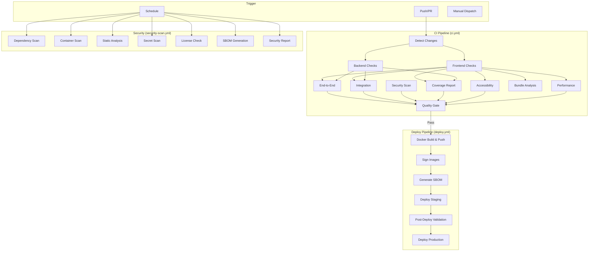

# CI/CD Guide

> StadiumOS AI v0.1.0

## Pipeline Architecture



## Workflows

| Workflow | File | Trigger | Duration |
|----------|------|---------|----------|
| CI | `.github/workflows/ci.yml` | Push/PR to main | ~10-15min |
| Deploy | `.github/workflows/deploy.yml` | CI success / manual | ~5-10min |
| Security | `.github/workflows/security-scan.yml` | Weekly / main push | ~10-15min |
| Performance | `.github/workflows/performance-test.yml` | Weekly / main push | ~15-20min |
| Release | `.github/workflows/release.yml` | Tag push / manual | ~5-10min |

## Quality Gates

| Gate | Threshold | Blocks Deploy |
|------|-----------|---------------|
| Unit tests | 100% pass | ✅ |
| Code coverage | ≥80% | ✅ |
| TypeScript | No errors | ✅ |
| Lint | No errors | ✅ |
| Security vulns | No critical/high | ✅ |
| E2E tests | 100% pass | ✅ |
| Integration | ≥95% pass | ✅ |
| Bundle size | <500KB gzip | ⚠️ Advisory |
| Accessibility | ≥90 Lighthouse | ⚠️ Advisory |
| Performance p95 | <1s API | ⚠️ Advisory |

## Local CI Simulation

```bash
# Frontend
cd frontend
pnpm typecheck
pnpm lint
pnpm format:check
pnpm test:coverage
pnpm build

# Backend
cd backend
ruff check app/
mypy app/ --strict
black --check app/
isort --check-only app/
pytest --cov=app --cov-fail-under=85
bandit -r app/ -ll
```

## Secrets Required

| Secret | Used By | Description |
|--------|---------|-------------|
| `STAGING_SSH_KEY` | Deploy | SSH key for staging host |
| `PRODUCTION_SSH_KEY` | Deploy | SSH key for production host |
| `SLACK_DEPLOY_WEBHOOK` | Deploy | Slack notifications |
| `SEMGREP_APP_TOKEN` | Security | Semgrep SAST |

## Environment Variables (Deploy)

| Variable | Default | Description |
|----------|---------|-------------|
| `STAGING_URL` | `https://staging.stadiumos.ai` | Staging endpoint |
| `STAGING_HOST` | - | Staging SSH host |
| `STAGING_USER` | - | Staging SSH user |
| `PRODUCTION_URL` | `https://stadiumos.ai` | Production endpoint |
| `PRODUCTION_HOST` | - | Production SSH host |
| `PRODUCTION_USER` | - | Production SSH user |
| `PROMETHEUS_URL` | - | Prometheus endpoint for validation |
