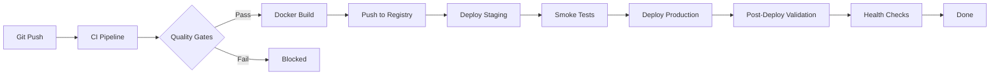

# Deployment Guide

> StadiumOS AI v0.1.0

## Supported Deployment Targets

| Target | Type | Status | Documentation |
|--------|------|--------|---------------|
| Docker Compose | Self-managed | ✅ Production-ready | This guide |
| Vercel | Serverless (Frontend) | ✅ Supported | [Vercel Docs](#vercel) |
| Google Cloud Run | Serverless (Backend) | ✅ Supported | [Cloud Run Guide](#cloud-run) |
| Azure App Service | PaaS (Backend) | ✅ Supported | [Azure Guide](#azure) |
| AWS ECS | Container | ✅ Supported | [ECS Guide](#aws-ecs) |
| Kubernetes | Orchestrated | 🚧 Future-ready | [K8s Guide](#kubernetes) |

## Docker Compose (Default)

### Prerequisites
- Docker 24+ with Compose V2
- Git

### Quick Start

```bash
# Clone & enter
git clone <repo> stadiumos && cd stadiumos

# Deploy production stack
docker compose -f infra/compose/docker-compose.yml up -d

# Deploy with monitoring
docker compose \
  -f infra/compose/docker-compose.yml \
  -f infra/compose/docker-compose.monitoring.yml \
  up -d

# Verify
curl http://localhost:8000/api/v1/health
curl http://localhost:3000
```

### Environment Override

```bash
# Custom ports
FRONTEND_PORT=8080 BACKEND_PORT=9090 docker compose up -d

# Custom image tag
IMAGE_TAG=v0.1.0 docker compose up -d

# Staging environment
ENVIRONMENT=staging docker compose up -d
```

## Vercel

### Frontend Deployment

```bash
# Install Vercel CLI
npm i -g vercel

# Deploy
cd frontend
vercel --prod

# Environment variables (set in Vercel Dashboard)
NEXT_PUBLIC_API_URL=https://api.stadiumos.ai
NEXT_PUBLIC_APP_URL=https://stadiumos.ai
```

## Cloud Run

### Backend Deployment

```bash
# Build and push
gcloud builds submit --tag gcr.io/$PROJECT/stadiumos-backend

# Deploy
gcloud run deploy stadiumos-backend \
  --image gcr.io/$PROJECT/stadiumos-backend \
  --platform managed \
  --region us-central1 \
  --memory 1Gi \
  --cpu 1 \
  --min-instances 1 \
  --max-instances 10 \
  --concurrency 80 \
  --timeout 300 \
  --set-env-vars "ENVIRONMENT=production,DATABASE_URL=..."
```

## Deployment Pipeline



## Rollback

```bash
# Manual rollback via deploy script
ROLLBACK=true ./infra/scripts/deploy.sh production

# Rollback via GitHub Actions
gh workflow run deploy.yml \
  -f environment=production \
  -f rollback=true
```

## Health Checks

After deployment, verify:

```bash
# Core endpoints
curl -f http://localhost:8000/api/v1/health
curl -f http://localhost:8000/api/v1/ready
curl -f http://localhost:8000/api/v1/live
curl -f http://localhost:3000

# Monitoring (if deployed)
curl -f http://localhost:9090/-/healthy   # Prometheus
curl -f http://localhost:3001/api/health  # Grafana
```
