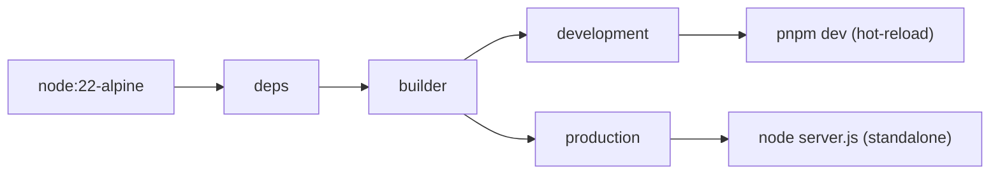
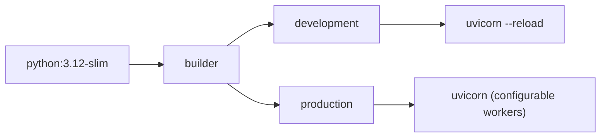

# Docker Guide

> StadiumOS AI v0.1.0

## Image Architecture

### Frontend (`infra/docker/frontend/Dockerfile`)



| Stage | Base Image | Size | User | Healthcheck | Use Case |
|-------|-----------|------|------|-------------|----------|
| `deps` | node:22-alpine | ~200MB | root | - | Dependency fetch |
| `builder` | node:22-alpine | ~1GB | root | - | Production build |
| `development` | node:22-alpine | ~500MB | root | ✅ | Local dev |
| `production` | node:22-alpine | ~150MB | `nextjs` (1001) | ✅ | Production |

### Backend (`infra/docker/backend/Dockerfile`)



| Stage | Base Image | Size | User | Healthcheck | Use Case |
|-------|-----------|------|------|-------------|----------|
| `builder` | python:3.12-slim | ~500MB | root | - | Wheel compilation |
| `development` | python:3.12-slim | ~600MB | root | ✅ | Local dev |
| `production` | python:3.12-slim | ~200MB | `stadiumos` (1000) | ✅ | Production |

## Image Optimization

| Optimization | Frontend | Backend |
|-------------|----------|---------|
| Multi-stage builds | ✅ (4 stages) | ✅ (3 stages) |
| Non-root user | ✅ `nextjs:1001` | ✅ `stadiumos:1000` |
| `.dockerignore` | ✅ | ✅ |
| Health checks | ✅ `curl -f /api/health` | ✅ `curl -f /api/v1/health` |
| Minimal base image | alpine | slim |
| Cache mounts | Docker BuildKit | ✅ |

## Build Commands

```bash
# Development builds
docker build -f infra/docker/frontend/Dockerfile --target development -t stadiumos-frontend:dev frontend/
docker build -f infra/docker/backend/Dockerfile --target development -t stadiumos-backend:dev backend/

# Production builds
docker build -f infra/docker/frontend/Dockerfile --target production -t stadiumos-frontend:latest frontend/
docker build -f infra/docker/backend/Dockerfile --target production -t stadiumos-backend:latest backend/

# With BuildKit caching (CI)
DOCKER_BUILDKIT=1 docker build \
  --cache-from type=gha \
  --cache-to type=gha,mode=max \
  -f infra/docker/frontend/Dockerfile \
  --target production \
  -t stadiumos-frontend:latest frontend/

# Scan for vulnerabilities
docker scout quickview stadiumos-frontend:latest
docker scout cves stadiumos-backend:latest

# Test images locally
docker compose -f infra/compose/docker-compose.yml up -d
```

## Docker Compose Profiles

| Profile | File | Services | Use Case |
|---------|------|----------|----------|
| Production | `docker-compose.yml` | frontend, backend, db, redis, worker | Default stack |
| Development | `docker-compose.dev.yml` | Overrides for hot-reload | Local development |
| Monitoring | `docker-compose.monitoring.yml` | prometheus, grafana, loki, tempo, exporters | Observability |

## Environment Variables

| Variable | Default | Description |
|----------|---------|-------------|
| `TARGET` | `production` | Docker build target |
| `IMAGE_TAG` | `latest` | Image version tag |
| `NODE_VERSION` | `22-alpine` | Node.js base image |
| `PYTHON_VERSION` | `3.12-slim` | Python base image |
| `FRONTEND_PORT` | `3000` | Frontend host port |
| `BACKEND_PORT` | `8000` | Backend host port |
| `ENVIRONMENT` | `production` | Runtime environment |
| `LOG_LEVEL` | `info` | Logging level |
| `GUNICORN_WORKERS` | `4` | Backend worker count |

## Security

- Images run as non-root users
- Alpine-based for minimal attack surface
- `.dockerignore` prevents secret exposure
- Health checks prevent routing to unhealthy containers
- Signed images with Cosign (CI)
- SBOM generation on build
- Regular vulnerability scanning with Trivy
