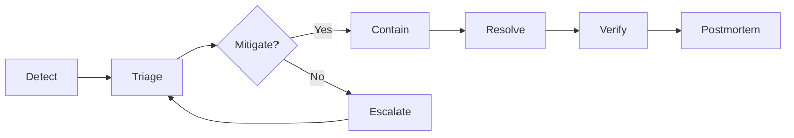

# Incident Response Guide

> StadiumOS AI v0.1.0

## Incident Severity Levels

| Level | Label | Response Time | Example |
|-------|-------|---------------|---------|
| SEV-1 | Critical | 15 minutes | Complete outage, data loss |
| SEV-2 | High | 30 minutes | Major feature unavailable |
| SEV-3 | Medium | 2 hours | Partial degradation |
| SEV-4 | Low | 24 hours | Minor issue, cosmetic |

## Incident Lifecycle



## Detection Channels

| Channel | Source | Automated |
|---------|--------|-----------|
| Prometheus Alerts | Alert rules | ✅ |
| Grafana Dashboards | Visual monitoring | ❌ |
| GitHub Actions | CI/CD failures | ✅ |
| Loki Logs | Error pattern detection | ✅ |
| Sentry | Error tracking | ✅ |
| User Reports | Support channels | ❌ |

## Response Playbooks

### SEV-1: Service Outage

```yaml
detection: Prometheus alert "ServiceDown" or health check failure
response_time: 15 minutes
playbook:
  1. Acknowledge incident (#incidents channel)
  2. Check Prometheus alerts for context
  3. Check service logs: `docker compose logs --tail=200 <service>`
  4. Check health endpoints:
     - curl -f http://localhost:8000/api/v1/health
     - curl -f http://localhost:3000/api/health
  5. If database issue:
     - Check PostgreSQL: `docker compose exec db pg_isready`
     - Check connection pool
     - Restore from backup if data corruption
  6. If application issue:
     - Restart service: `docker compose restart <service>`
     - Rollback to previous version if needed
  7. Verify recovery
  8. File postmortem within 24h
```

### SEV-2: API Degradation

```yaml
detection: Latency alerts (p95 > 1s) or error rate > 5%
response_time: 30 minutes
playbook:
  1. Acknowledge incident
  2. Check Grafana API Latency dashboard
  3. Identify slow endpoints from metrics
  4. Check recent deployments for correlation
  5. Scale backend: `docker compose up -d --scale backend=5`
  6. Check database query performance
  7. Consider rolling back recent changes
  8. Monitor for 15 minutes after mitigation
```

### SEV-3: AI Provider Issues

```yaml
detection: "AIProviderFailure" or "AISlowResponse" alerts
response_time: 2 hours
playbook:
  1. Check AI provider status (OpenAI / Gemini status page)
  2. Verify API keys are valid and not rate-limited
  3. Check AI metrics in Grafana
  4. Enable fallback provider if needed
  5. Consider reducing AI cache TTL
  6. Document issue in incident report
```

### SEV-4: Minor Issue

```yaml
detection: Bug report or minor monitoring anomaly
response_time: 24 hours
playbook:
  1. Log issue in GitHub Issues
  2. Tag with appropriate severity label
  3. Prioritize in next sprint
  4. No immediate action required
```

## Escalation Matrix

| Role | SEV-1 | SEV-2 | SEV-3 | SEV-4 |
|------|-------|-------|-------|-------|
| On-call Engineer | ✅ Lead | ✅ Lead | ✅ Lead | ✅ |
| Engineering Lead | ✅ Notify | ✅ Notify | ❌ | ❌ |
| CTO | ✅ Notify | ❌ | ❌ | ❌ |
| Security Team | ✅ If security | ❌ | ❌ | ❌ |

## Postmortem Process

### Required for: SEV-1, SEV-2

Template:

```markdown
## Incident Postmortem

**Date:** YYYY-MM-DD
**Severity:** SEV-X
**Duration:** X hours X minutes
**Detection:** How was this detected?
**Response:** Summary of actions taken

### Timeline
- HH:MM — Detection
- HH:MM — Triage started
- HH:MM — Mitigation applied
- HH:MM — Service restored

### Root Cause
[Detailed explanation]

### Resolution
[What fixed the issue]

### Action Items
- [ ] Add monitoring for [gap]
- [ ] Improve alert for [condition]
- [ ] Update runbook for [scenario]
```

## Communication

| Channel | Purpose |
|---------|---------|
| #incidents | Real-time incident coordination |
| #status | External status updates |
| GitHub Issues | Post-incident tracking |
| Email | SEV-1/SEV-2 stakeholder notification |
