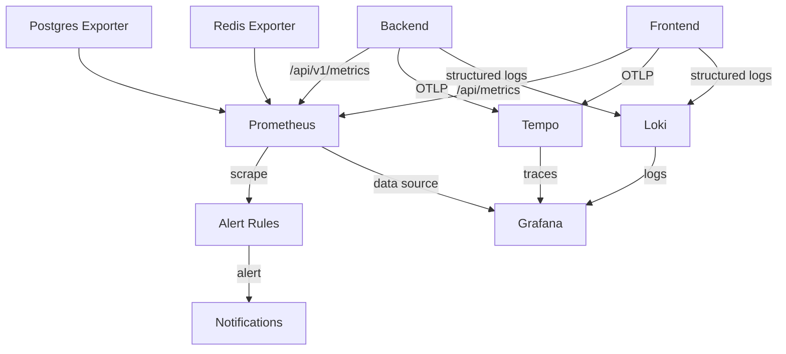

# Monitoring Guide

> StadiumOS AI v0.1.0

## Stack Components

| Component | Purpose | Image | Version |
|-----------|---------|-------|---------|
| Prometheus | Metrics collection & alerting | `prom/prometheus` | v2.53.0 |
| Grafana | Visualization & dashboards | `grafana/grafana` | v11.1.0 |
| Loki | Log aggregation | `grafana/loki` | v3.1.0 |
| Tempo | Distributed tracing | `grafana/tempo` | v2.5.0 |
| Postgres Exporter | Database metrics | `prometheuscommunity/postgres-exporter` | v0.15.0 |
| Redis Exporter | Cache metrics | `oliver006/redis_exporter` | v1.62.0 |

## Architecture



## Metrics Collected

### Application Metrics

| Metric | Type | Labels | Description |
|--------|------|--------|-------------|
| `http_requests_total` | Counter | method, endpoint, status | Total HTTP requests |
| `http_request_duration_seconds` | Histogram | method, endpoint, status | Request latency |
| `http_requests_in_flight` | Gauge | method | Concurrent requests |

### AI Metrics

| Metric | Type | Labels | Description |
|--------|------|--------|-------------|
| `ai_response_duration_seconds` | Histogram | provider, model | AI response latency |
| `ai_provider_errors_total` | Counter | provider, error_type | AI provider errors |
| `ai_provider_active` | Gauge | provider | Active provider tracking |
| `ai_tokens_total` | Counter | provider, type | Token consumption |
| `ai_rate_limit_hits_total` | Counter | provider | Rate limit events |

### Auth Metrics

| Metric | Type | Labels | Description |
|--------|------|--------|-------------|
| `auth_login_failures_total` | Counter | reason | Login failures |
| `auth_token_refresh_failures_total` | Counter | reason | Token refresh failures |
| `active_users` | Gauge | - | Currently active users |

### Business Metrics

| Metric | Type | Labels | Description |
|--------|------|--------|-------------|
| `crowd_capacity_percentage` | Gauge | zone_id | Zone capacity |
| `parking_occupancy_percentage` | Gauge | lot_id | Parking occupancy |
| `emergency_incidents_active` | Gauge | severity | Active incidents |

## Alert Rules

Alert rules are defined in `infra/monitoring/prometheus/rules/alerts.yml`.

### Critical Alerts

| Alert | Condition | For | Response |
|-------|-----------|-----|----------|
| `APIHighErrorRate` | 5xx rate > 5% | 2m | Immediate investigation |
| `AIProviderFailure` | AI errors > 0.1/s | 1m | Check API keys |
| `ServiceDown` | `up == 0` | 30s | Restart service |
| `QueueJobFailure` | Job failures > 0.1/s | 2m | Check workers |

### Warning Alerts

| Alert | Condition | For | Response |
|-------|-----------|-----|----------|
| `APISlowResponses` | p95 > 1s | 3m | Performance review |
| `AISlowResponse` | p95 > 5s | 2m | Check provider status |
| `HighMemoryUsage` | Memory > 85% | 5m | Scale up |
| `DatabaseConnectionPoolExhausted` | Pool > 80% | 2m | Increase pool |
| `AuthFailureRate` | Failures > 0.5/s | 2m | Security review |
| `QueueBacklog` | Queue > 1000 | 5m | Scale workers |

## Dashboards

### Operations Center (Grafana)

Default dashboard at `infra/monitoring/grafana/dashboards/operations-center.json`:

- **Row 1:** Service Health, Requests/sec, Error Rate, Latency (stat panels)
- **Row 2:** API Request Rate, Latency (p50/p95/p99), AI Response Time (time series)
- **Row 3:** Database Connections, Memory, CPU, Error Distribution
- **Row 4:** Deployments table, Active Incidents table

### Custom Dashboards

Create additional dashboards in Grafana for:

- **AI Performance:** Tokens, latency by provider, rate limits
- **User Activity:** Active users, session duration, feature usage
- **Business KPIs:** Zone capacity, parking occupancy, incident trends
- **CI/CD:** Build times, test pass rates, deployment frequency

## Logging

### Structured Log Format

```json
{
  "timestamp": "2026-07-18T12:00:00Z",
  "level": "INFO",
  "logger": "stadiumos.api",
  "message": "Request completed",
  "correlation_id": "abc-123-def",
  "method": "GET",
  "path": "/api/v1/health",
  "status_code": 200,
  "duration_ms": 45
}
```

### Log Levels

| Level | Usage |
|-------|-------|
| DEBUG | Development details |
| INFO | Normal operations |
| WARNING | Degraded but functional |
| ERROR | Functional failure |
| CRITICAL | System outage |

### Querying Logs (Loki)

```logql
# All errors in last hour
{app="stadiumos"} |= "ERROR"

# Specific service errors
{service="backend"} |= "ERROR" | json

# Trace by correlation ID
{app="stadiumos"} |= "abc-123-def"

# P95 API latency from logs
sum by (path) (rate({app="stadiumos", service="backend"}
  | json
  | duration_ms > 1000
  [5m]))
```

## Tracing

### Trace Context Propagation

The backend uses correlation IDs (`X-Correlation-ID` header) for trace propagation:

- **Frontend → Backend:** Correlation ID sent as header
- **Backend → External APIs:** Correlation ID forwarded
- **Backend → Queue:** Correlation ID attached to job
- **Logs → Traces:** Correlation ID links logs to traces in Tempo

### Viewing Traces

1. Open Grafana → Explore → Tempo
2. Search by trace ID, service name, or tags
3. Use the **Traces to Logs** link to jump from traces to related logs

## Running the Monitoring Stack

```bash
# Start with application
docker compose \
  -f infra/compose/docker-compose.yml \
  -f infra/compose/docker-compose.monitoring.yml \
  up -d

# Access
# Grafana: http://localhost:3001 (admin/stadiumos)
# Prometheus: http://localhost:9090
# Loki: http://localhost:3100

# Stop monitoring only
docker compose -f infra/compose/docker-compose.monitoring.yml down
```
