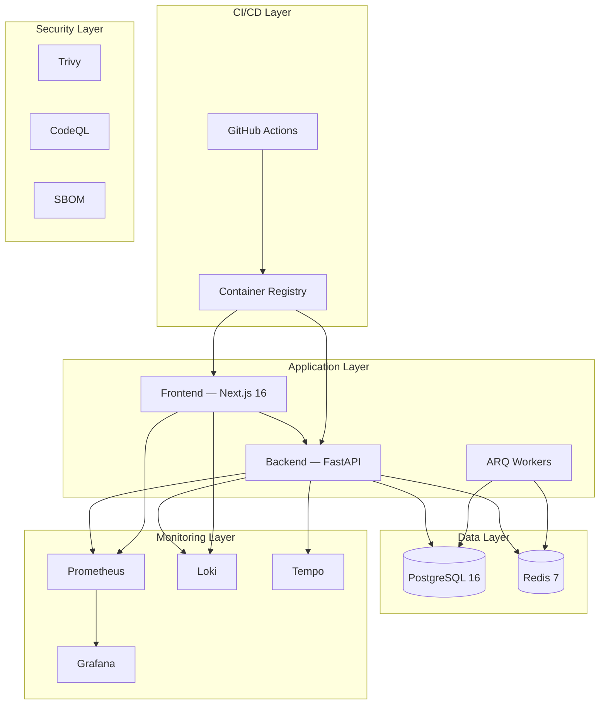

# Operations Manual

> StadiumOS AI v0.1.0

## Architecture Overview



## Service Management

### Docker Compose

```bash
# View all services
docker compose -f infra/compose/docker-compose.yml ps

# View logs
docker compose logs -f backend
docker compose logs -f frontend

# Restart a service
docker compose restart backend

# Scale a service
docker compose up -d --scale backend=5

# Full restart
docker compose down && docker compose up -d

# With monitoring
docker compose \
  -f infra/compose/docker-compose.yml \
  -f infra/compose/docker-compose.monitoring.yml \
  up -d
```

### Health Checks

| Endpoint | Purpose | Expected |
|----------|---------|----------|
| `/api/v1/health` | Overall health + dependency checks | 200 + `status: healthy` |
| `/api/v1/ready` | Readiness (accepts traffic) | 200 |
| `/api/v1/live` | Liveness (process alive) | 200 |
| `/api/v1/metrics` | Prometheus metrics endpoint | 200 |

## Monitoring Stack

| Service | Port | Default Credentials | Purpose |
|---------|------|-------------------|---------|
| Prometheus | 9090 | - | Metrics collection |
| Grafana | 3001 | admin / stadiumos | Dashboards & visualization |
| Loki | 3100 | - | Log aggregation |
| Tempo | 3200 | - | Distributed tracing |
| Postgres Exporter | 9187 | - | Database metrics |
| Redis Exporter | 9121 | - | Cache metrics |

## Daily Operations

### Morning Checks

```bash
# 1. Health check
./infra/scripts/healthcheck.sh

# 2. Check logs for errors
docker compose logs --tail=100 backend | grep -i error

# 3. Check disk usage
df -h /var/lib/docker

# 4. Check backup success
ls -la ./backups/postgres/ | tail -5
```

### Weekly Tasks

- Review Grafana dashboards
- Check Prometheus alert rules
- Rotate logs if needed
- Review CI pipeline performance
- Check dependency vulnerabilities

### Monthly Tasks

- Full backup verification
- Security scan review
- Performance benchmark review
- Dependency updates
- Certificate expiry check
- Access review

## Backup & Recovery

### Backup Strategy

| Data | Method | Frequency | Retention | Location |
|------|--------|-----------|-----------|----------|
| PostgreSQL | `pg_dump` (custom format) | Daily | 30 days | `./backups/postgres/` |
| Docker volumes | Volume backup | Weekly | 90 days | External storage |
| Configuration | Git | Per commit | Git history | GitHub |

### Recovery

```bash
# Database restore
./infra/scripts/restore.sh ./backups/postgres/stadiumos_20260718_000000.sql.gz

# Full stack restart
docker compose down -v   # Warning: destroys volumes
docker compose up -d
docker compose exec backend alembic upgrade head
```

## Scaling

| Component | Strategy | Limit |
|-----------|----------|-------|
| Frontend | Horizontal (multiple containers) | Stateless — unlimited |
| Backend | Horizontal + Workers config | `GUNICORN_WORKERS` env |
| Database | Connection pool sizing | `DATABASE_POOL_SIZE` |
| Redis | Vertical (more memory) | Instance size |

## Disaster Recovery

### RPO / RTO

| Metric | Target |
|--------|--------|
| Recovery Point Objective (RPO) | 24 hours (daily backup) |
| Recovery Time Objective (RTO) | 1 hour |

### Recovery Steps

1. Provision infrastructure (Terraform / manual)
2. Restore PostgreSQL from latest backup
3. Deploy latest Docker images
4. Run database migrations
5. Verify health checks
6. Switch DNS if needed
