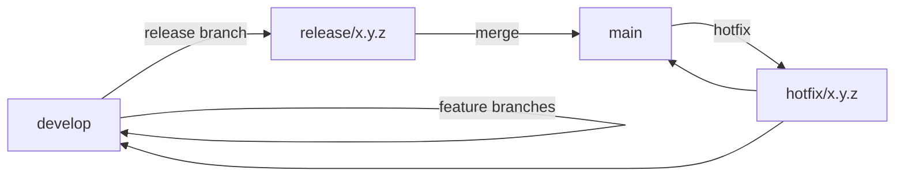
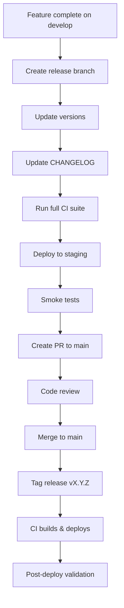
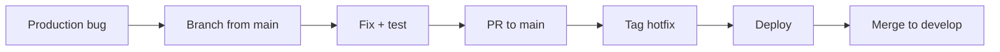

# Release Process

> StadiumOS AI v0.1.0

## Versioning

This project follows **Semantic Versioning** (`MAJOR.MINOR.PATCH`):

| Component | Source of Truth |
|-----------|-----------------|
| Frontend | `frontend/package.json` — `version` field |
| Backend | `backend/app/core/config.py` — `app_version` |
| Docker | Image tags match Git tags |
| Docs | `CHANGELOG.md` |

## Branch Strategy



| Branch | Purpose | Deploy Target |
|--------|---------|---------------|
| `main` | Production-ready | Production |
| `develop` | Integration branch | Staging |
| `feature/*` | Feature work | None |
| `release/*` | Release preparation | Staging |
| `hotfix/*` | Urgent production fixes | Production |

## Release Workflow

### Standard Release



### Hotfix Release



## Release Checklist

### Pre-Release

- [ ] All CI checks pass on `develop`
- [ ] Coverage ≥ 80%
- [ ] No critical security vulnerabilities
- [ ] CHANGELOG updated for new version
- [ ] Version bumped in `frontend/package.json`
- [ ] Version bumped in `backend/app/core/config.py`
- [ ] Release branch created (`release/x.y.z`)

### Staging Verification

- [ ] Deployed to staging environment
- [ ] Health check passes (`/api/v1/health`)
- [ ] Smoke tests pass
- [ ] E2E tests pass on staging
- [ ] Performance metrics within baseline
- [ ] Accessibility score ≥ 90
- [ ] No regressions identified

### Production Release

- [ ] PR approved and merged to `main`
- [ ] Git tag created (`vX.Y.Z`)
- [ ] Docker images built and signed
- [ ] Deployed to production
- [ ] Health check passes
- [ ] Monitoring dashboard green
- [ ] Post-deploy validation complete
- [ ] Stakeholders notified

## Rollback Procedure

### Automatic Rollback

The deploy pipeline automatically rolls back if:
- Health checks fail after deployment
- Error rate spikes > 5% within 5 minutes
- p99 latency exceeds 3s

### Manual Rollback

```bash
# Via deploy script
ROLLBACK=true ./infra/scripts/deploy.sh production

# Via GitHub Actions
gh workflow run deploy.yml \
  -f environment=production \
  -f rollback=true
```

### Rollback Verification

After rollback, verify:
- Health endpoints return 200
- Previous image tag is running
- No data loss occurred
- Users can access the platform
- All features functional

## Release Artifacts

| Artifact | Location | Retention |
|----------|----------|-----------|
| Docker images | `ghcr.io/stadiumos/*` | Indefinite |
| Git tags | GitHub | Indefinite |
| SBOM | Workflow artifacts | 90 days |
| Test reports | Workflow artifacts | 14 days |
| Deployment logs | Cloud Logging | 30 days |
