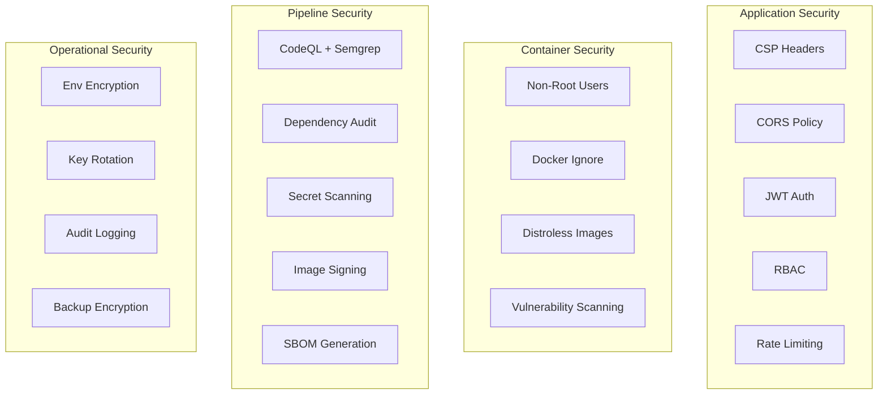

# Security Guide

> StadiumOS AI v0.1.0

## Security Architecture



## Automated Security Scanning

| Scan | Tool | Frequency | Location |
|------|------|-----------|----------|
| SAST | CodeQL (JavaScript + Python) | Every push | `.github/workflows/ci.yml` |
| SAST | Semgrep | Weekly | `.github/workflows/security-scan.yml` |
| Dependency | `pnpm audit` | Every push | CI pipeline |
| Dependency | `safety` / `pip-audit` | Every push | CI pipeline |
| Container | Trivy | Every push | CI + Deploy pipeline |
| Secret | TruffleHog + Gitleaks | Every push | CI pipeline |
| License | License Checker | Weekly | Security scan |
| SBOM | Anchore Syft | Every build | CI + Deploy pipeline |

## Container Security

### Base Images

| Component | Image | Rationale |
|-----------|-------|-----------|
| Frontend | `node:22-alpine` | Minimal surface, common base |
| Backend | `python:3.12-slim` | Smaller than full, avoids build deps |

### Hardening

```dockerfile
# Non-root user
RUN adduser --system --uid 1001 nextjs
USER nextjs

# No package manager in production
# No shell in production stages
# Read-only filesystem where possible
```

### Image Scanning Results

All images are scanned with Trivy during CI. Results published to GitHub Security tab.

## Dependency Management

### Frontend

```bash
# Audit
pnpm audit --audit-level=high

# Fix
pnpm audit --fix

# Check outdated
pnpm outdated

# Update safely
pnpm update --interactive
```

### Backend

```bash
# Audit
pip install pip-audit
pip-audit -r requirements.txt

# Check outdated
pip list --outdated

# Update safely
pip-compile --upgrade requirements.in
```

## Secret Management

### What NOT to commit

- API keys (OpenAI, Gemini)
- Database passwords
- JWT secrets
- Auth secrets
- Cloud service credentials
- SSH keys
- TLS certificates

### Architecture

```
GitHub Secrets ──→ CI/CD Pipeline ──→ Environment Variables
     │                     │
     │                     ▼
     │              .env file (runtime)
     │
Cloud Secret Manager ──→ Production Runtime
     (GCP / AWS / Azure)
```

### Runtime Secrets

| Secret | CI/CD | Production |
|--------|-------|------------|
| `AUTH_SECRET` | GitHub Secret | Cloud Secret Manager |
| `JWT_SECRET` | GitHub Secret | Cloud Secret Manager |
| `OPENAI_API_KEY` | GitHub Secret | Cloud Secret Manager |
| `GEMINI_API_KEY` | GitHub Secret | Cloud Secret Manager |
| `SENTRY_DSN` | GitHub Secret | Cloud Secret Manager |
| `DATABASE_URL` | Injected | Cloud Secret Manager |

## Network Security

### CORS

```typescript
// Frontend sends, backend validates
CORS_ORIGINS=https://stadiumos.ai,https://api.stadiumos.ai
```

### CSP Headers

```typescript
Content-Security-Policy: default-src 'self';
  script-src 'self' 'unsafe-inline';
  style-src 'self' 'unsafe-inline';
  img-src 'self' data: blob:;
  connect-src 'self' https: wss:;
  frame-src 'none';
  object-src 'none';
```

### Additional Security Headers

- `X-Frame-Options: DENY`
- `X-Content-Type-Options: nosniff`
- `Referrer-Policy: strict-origin-when-cross-origin`
- `Permissions-Policy: camera=(), microphone=(), geolocation=(self)`

## SBOM (Software Bill of Materials)

SBOMs are generated automatically in SPDX JSON format during:

1. **CI Pipeline** — Source code SBOM
2. **Docker Build** — Container image SBOM

```bash
# Signed SBOMs stored in GitHub artifacts (90-day retention)
gh run download --name sbom-artifacts
```

## Incident Response

See [Incident Response Guide](incident-response-guide.md) for security incident procedures.

## Compliance

- All secrets encrypted at rest and in transit
- Container images built with provenance attestations
- SBOMs generated for every build
- Dependencies audited every commit
- Access limited via RBAC
- Audit trail via structured logging
