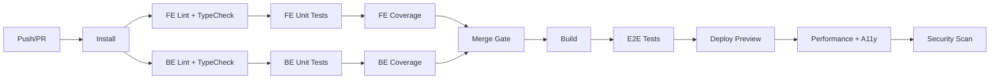

# Test Plan

> StadiumOS AI v0.1.0

## Overview

Testing strategy covering unit, integration, e2e, performance, accessibility, and security testing for the StadiumOS AI platform.

## Test Levels

| Level | Scope | Tool | Location |
|-------|-------|------|----------|
| Unit | Functions, hooks, utilities | Vitest (FE) / pytest (BE) | `__tests__/` per module |
| Integration | API endpoints, module services | pytest + httpx | `backend/tests/` |
| Component | React components | Vitest + Testing Library | `__tests__/` per feature |
| E2E | Full user flows | Playwright | `frontend/e2e/` |
| Performance | Load, stress, endurance | k6 | `k6/` |
| Accessibility | WCAG 2.2 AA | axe-core, Lighthouse | CI pipeline |
| Security | Auth, XSS, CSRF, SQLi | OWASP ZAP | `security/` |

## Testing Architecture

### Frontend
- **Vitest** for unit and component tests
- **React Testing Library** for component tests
- **Playwright** for E2E tests
- **axe-core** for accessibility audits

### Backend
- **pytest** for unit and integration tests
- **httpx** for async API tests
- **pytest-asyncio** for async test support
- **pytest-cov** for coverage

## Test Environment

```
┌─────────────────────────────────────────────────┐
│               CI Pipeline (GitHub Actions)       │
│                                                   │
│  ┌──────────┐   ┌──────────┐   ┌──────────┐    │
│  │ Frontend  │   │ Backend  │   │  E2E     │    │
│  │ Tests     │──▶│ Tests    │──▶│ Tests    │    │
│  │ (Vitest)  │   │ (pytest) │   │(Playwright│    │
│  └──────────┘   └──────────┘   └──────────┘    │
│       │               │               │          │
│       ▼               ▼               ▼          │
│  ┌──────────┐   ┌──────────┐   ┌──────────┐    │
│  │ Codecov  │   │  Pytest  │   │ Allure   │    │
│  │ Report   │   │  Report  │   │ Report   │    │
│  └──────────┘   └──────────┘   └──────────┘    │
└─────────────────────────────────────────────────┘
```

## Test Data Strategy

- **Fixtures:** Static JSON fixtures in `frontend/__tests__/fixtures/` and `backend/tests/fixtures/`
- **Factories:** Factory Boy for database model factories (backend)
- **Mocks:** MSW (Mock Service Worker) for API mocks (frontend)
- **Seeds:** Predefined seed data for integration tests

## Running Tests

```bash
# Frontend unit/component tests
cd frontend && npm test

# Frontend E2E tests
cd frontend && npx playwright test

# Backend tests
cd backend && pytest

# Backend with coverage
cd backend && pytest --cov=app --cov-report=html

# All tests (CI pipeline)
npm run test:all
```

## Quality Gates

| Gate | Threshold | Enforcement |
|------|-----------|-------------|
| Unit test pass rate | 100% (all pass) | CI blocking |
| Code coverage | ≥80% | CI blocking |
| E2E pass rate | 100% (all pass) | CI blocking |
| Accessibility score | ≥90 Lighthouse | CI advisory |
| Performance budget | LCP < 2.5s, CLS < 0.1 | CI advisory |
| Security scan | No critical/high | CI blocking |

## CI Pipeline



## Test Coverage Targets

| Module | Unit | Integration | E2E |
|--------|------|-------------|-----|
| Command Center | 80% | ✅ | ✅ |
| Crowd Intelligence | 80% | ✅ | ✅ |
| Emergency Response | 80% | ✅ | ✅ |
| Digital Twin | 80% | ✅ | - |
| AI Copilot | 80% | ✅ | ✅ |
| Predictive Maintenance | 80% | ✅ | - |
| Smart Parking | 80% | ✅ | ✅ |
| Queue Intelligence | 80% | ✅ | ✅ |
| Executive Analytics | 80% | ✅ | - |
| Enterprise Security | 80% | ✅ | - |
| Tournament Ops | 80% | ✅ | - |
| Sustainability | 80% | ✅ | - |
| Accessibility Center | 80% | - | ✅ |
| Performance Center | 80% | - | - |

## Key Test Scenarios

### Authentication
- Login with valid credentials returns tokens
- Login with invalid credentials returns 401
- Expired access token refreshes automatically
- Invalid refresh token returns 401
- RBAC restrictions enforced

### Crowd Intelligence
- Zone data loads and auto-refreshes
- Heatmap renders correctly
- Capacity alerts trigger at thresholds
- Real-time updates via WebSocket

### Emergency Response
- Incident creation and dispatch workflow
- AI analysis generates recommendations
- Real-time status updates
- Audit trail logging

### Digital Twin
- Stadium map renders with layers
- Time travel shows historical data
- Simulation controls work
- Zone detail panel updates

### AI Copilot
- Chat messages send and receive responses
- Context is maintained in conversation
- Provider fallback works
- Rate limiting is enforced

## Performance Testing

### Load Test Scenarios (k6)

| Scenario | VUs | Duration | Expected p95 |
|----------|-----|----------|--------------|
| Normal load | 100 | 10m | < 500ms |
| Peak load | 500 | 5m | < 1s |
| Stress test | 1000 | 3m | < 2s |
| Endurance | 200 | 60m | < 1s |

### Performance Budgets

| Metric | Budget |
|--------|--------|
| LCP | < 2.5s |
| INP | < 200ms |
| CLS | < 0.1 |
| TTFB | < 600ms |
| API p95 latency | < 500ms |
| API p99 latency | < 2s |
| Frontend bundle size | < 500KB (gzipped) |

## Security Testing

### Scenarios
- JWT token tampering detection
- SQL injection prevention (parameterized queries)
- XSS prevention (React default escaping)
- CSRF protection (same-origin + token)
- Rate limiting enforcement
- API key validation

### Tools
- OWASP ZAP for DAST scanning
- npm audit for dependency scanning
- Safety CLI for Python dependency scanning
- TruffleHog for secret scanning

## Reporting

| Report | Tool | Format | Location |
|--------|------|--------|----------|
| Coverage | Codecov | Dashboard | `codecov.io/` |
| E2E | Allure | HTML | `allure-report/` |
| Performance | k6 | HTML | `k6/report.html` |
| A11y | Lighthouse | JSON | `lighthouse/` |
| Security | OWASP ZAP | HTML | `security/reports/` |

## Review Cycle

| Interval | Activity |
|----------|----------|
| Per commit | Full CI suite runs |
| Per PR | All tests + review gate |
| Weekly | Performance report review |
| Monthly | Full security scan |
| Per release | Complete regression suite |
